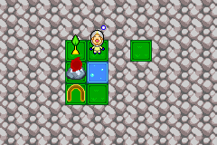
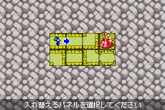
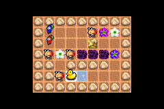
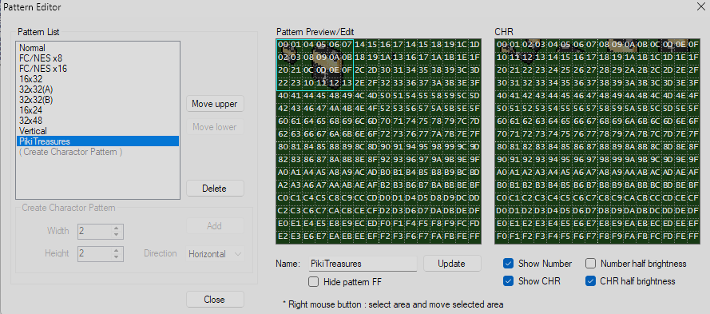
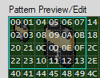
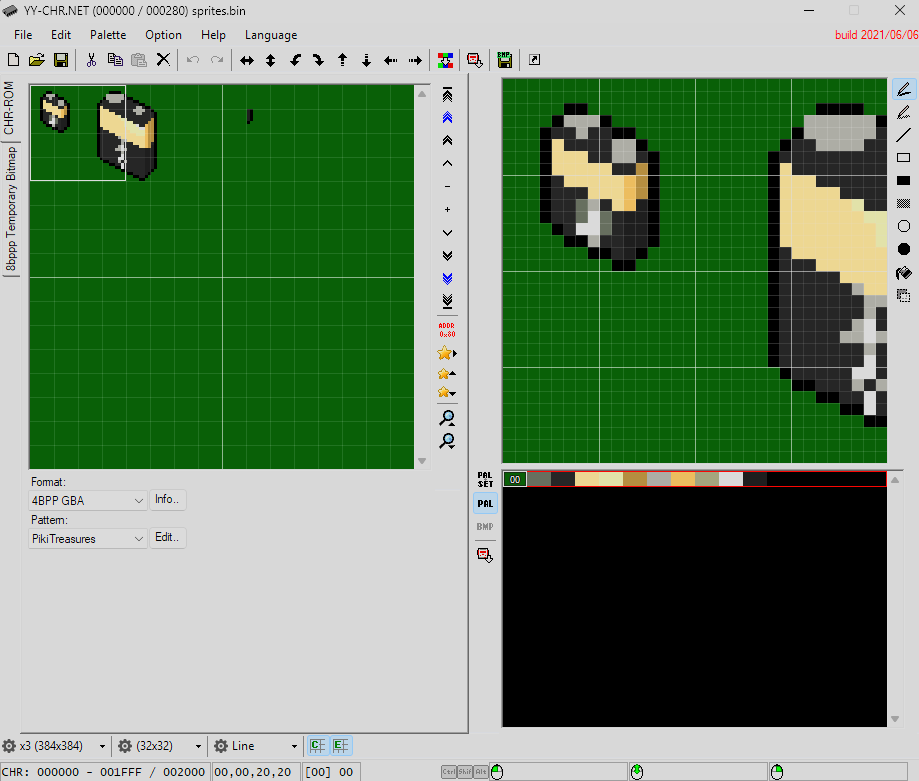
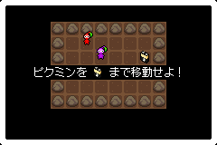
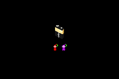

# Piket Usage Guide
This document will provide you with all the knowledge you need to take full advantage of Piket.

## Contents
- [Format Conversion](#format-conversion)
- [Level Editing](#level-editing)
  - [Plucking Pikmin](#plucking-pikmin)
  - [Connecting Pikmin](#connecting-pikmin)
  - [Marching Pikmin](#marching-pikmin)
- [Custom Treasures in Marching Pikmin](#custom-treasures-in-marching-pikmin)
  - [Export Treasure Data](#export-treasure-data)
  - [Editing Treasure Data](#editing-treasure-data)
- [Download and Play](#download-and-play)

## Format Conversion
Let's start with simple file format conversion:
```py
import piket
from pathlib import Path
import logging

logging.basicConfig(level=logging.DEBUG) # output detailed logs

card = piket.decode("card.raw") # decode the raw card
Path("card.bin").write_bytes(card) # write the output

card = piket.encode(card, "card.raw") # re-encode the card
Path("newcard.raw").write_bytes(card) # write the output
```

## Level Editing
Level editing is slightly different for different minigame modes. Marching Pikmin is the most complex, so that's covered last.

### Plucking Pikmin
```py
from piket import Card, PluckingPikmin as P
from pathlib import Path

card = Card("12-A001.raw") # import Plucking Pikmin card

# ensure that the level we want to edit is a Plucking Pikmin level
if isinstance(card.levels[0], P.Level):
    lvl: P.Level = card.levels[0]
    lvl.clear_all() # sets all tiles and pikis to 0x0
    lvl.grid = (4, 3) # sets the level to a 4x3 grid, maximum 11x8
    lvl.start = (1, 0) # sets the starting position
    lvl.player = P.Player.LOUIE # sets the player character

    lvl.set_grid(P.Tile.GRASS) # sets all tiles in the grid (4x3) to grass
    lvl.set_tile(0, 0, P.Piki.YELLOW) # places yellow Pikmin at top-left
    lvl.set_tiles(2, 0, 1, 3, P.Tile.NONE) # removes tiles
    lvl.set_tiles(3, 1, 1, 2, P.Tile.NONE) # removes tiles
    lvl.set_tile(0, 1, P.Tile.FIRE) # places fire geyser at (0, 1)
    lvl.set_tile(1, 1, P.Tile.WATER) # places water pool at (1, 1)
    lvl.set_tile(0, 2, P.Tile.ELECTRICITY_NODE) # places electricity node at (0, 2)
    lvl.set_tile(1, 2, P.Tile.ELECTRICTY) # places electricity at (1, 2)

Path("12-A001-New.raw").write_bytes(card.encode())
```
This is the result of our custom Plucking Pikmin level:



### Connecting Pikmin
```py
from piket import Card, ConnectingPikmin as C
from pathlib import Path

card = Card("12-C001.raw") # import Connecting Pikmin card

# ensure that the level we want to edit is a Connecting Pikmin level
if isinstance(card.levels[0], C.Level):
    level: C.Level = card.levels[0]
    level.clear_all() # sets all tiles, objects and pikis to 0x0
    level.grid = (4, 2) # sets the level to a 4x2 grid, maximum 9x6

    level.set_grid(C.Tile.NONE) # clears all tiles in the grid (4x2) (recommended)
    # build layout with set_tile() and set_tiles()
    level.set_tiles(0, 0, 2, 1, C.Tile.HORIZONTAL)
    level.set_tile(2, 0, C.Tile.BOTTOM_RIGHT)
    level.set_tile(3, 0, C.Tile.VERTICAL)
    level.set_tile(0, 1, C.Tile.TOP_RIGHT)
    level.set_tile(1, 1, C.Tile.HORIZONTAL)
    level.set_tile(2, 1, C.Tile.BOTTOM_LEFT)
    level.set_tile(3, 1, C.Tile.HORIZONTAL)

    level.set_tile(0, 0, C.Piki.BLUE_RIGHT) # places blue pikmin facing right at (0, 0)
    level.set_tile(3, 0, C.Object.GOAL) # places the ship pod goal object at (3, 0)

Path("12-C001-New.raw").write_bytes(card.encode())
```
This is the result of our custom Connecting Pikmin level:



### Marching Pikmin
```py
from piket import Card, MarchingPikmin as M
from pathlib import Path

card = Card("12-B001.raw")

if isinstance(card.levels[0], M.Level):
    lvl: M.Level = card.levels[0]
    lvl.clear_all() # clears all tiles and removes all Pikmin

    w, h = 9, 7 # width, height, maximum 32x11 (y=0 and y=11 are half-cutoff)
    x, y = 1, 2 # game doesn't handle vertical centering, factor that in when building

    lvl.set_tiles(x,   y,   w,   h,   M.Tile.ROCK  ) # sets outer perimiter to rocks
    lvl.set_tiles(x+1, y+1, w-2, h-2, M.Tile.GROUND) # fills inner with ground

    lvl.add_piki(2, 3, M.Piki.BLUE) # places a blue Pikmin at (2, 3)
    lvl.add_piki(2, 4, M.Piki.RED) # places a red Pikmin at (2, 4)
    lvl.set_tiles(2, 5, 3, 1, M.Tile.BULBORB) # places bulborbs from (2, 5) to (4, 5)
    lvl.set_tile(3, 5, M.Tile.WHITE_CANDYPOP) # overwrites a bulborb with an ivory candypop bud at (3, 5)
    lvl.set_tile(3, 7, M.Tile.BULBORB) # you should be able to read the rest...
    lvl.set_tile(6, 3, M.Tile.BULBORB)

    lvl.set_tiles(5, 5, 3, 1, M.Tile.POISON)
    lvl.set_tile(6, 4, M.Tile.ELECTRICITY)
    lvl.set_tile(5, 7, M.Tile.WATER)

    lvl.set_tile(7, 3, M.Tile.PURPLE_CANDYPOP)
    lvl.set_tile(8, 5, M.Tile.BLUE_CANDYPOP)
    lvl.set_tile(8, 3, M.Tile.WHITE_CANDYPOP)

    lvl.set_tiles(4, 6, 4, 1, M.Tile.ROCK)
    lvl.set_tiles(2, 6, 1, 2, M.Tile.ROCK)

    lvl.set_tile(4, 7, M.Tile.TREASURE) # places the treasure (goal) at (4, 7)

    lvl.use_custom_treasure = False # use built-in Rubber Ugly treasure

Path("12-B001-New.raw").write_bytes(card.encode())
```
This is the result of our custom Marching Pikmin level:



## Custom Treasures in Marching Pikmin
If you're feeling experimental you can try your hand at putting your very own custom treasure sprite into the card's data! I've written the `TreasureSprite` class to be very versatile, so there are several different ways you could do this.

### Export Treasure Data
```py
from piket import Card, MarchingPikmin as M
from pathlib import Path

card = Card("12-B001.raw")

if card.treasure:
    card.treasure.export_palette("palette.pal") # extracts palette data and writes to file
    card.treasure.export_small("small.png") # exports the small 16x16 treasure sprite
    card.treasure.export_large("large.png") # exports the large 32x32 treasure sprite

    # you can even just export the full image block data
    # to be used directly in tools like YY-CHR:
    Path("sprites.bin").write_bytes(card.treasure.sprites)
    # if you follow this method, also export palette with
    # the same stem ("sprites") so YY-CHR auto-loads it:
    card.treasure.export_palette("sprites.pal")
```
### Editing Treasure Data
There are numerous ways you could go about modifying the treasure sprites, but I'd recommend you use [YY-CHR (.NET version)](https://www.smwcentral.net/?p=section&a=details&id=27208). We'll go over how to do that here:

1. Launch `YYCHR.exe`.
2. Drag-and-drop exported `sprites.bin` onto YYCHR. It should automatically load `sprites.pal`. It will likely look corrupted, we'll fix that now.
3. Set `Format` to `4BPP GBA`.
4. Next to `Pattern`, click `Edit`, create a new pattern, and set it to match mine in the turquoise box:

    
    

5. Give the new pattern a name and click `Update` to add it. Close the Pattern Editor and select the new pattern from the list.
6. Edit the sprites and palette to your liking.
    - IMPORTANT: You only get to use that first row of colours in the palette editor (0x0 -> 0xF).
    - The left-most (0x00) colour will be rendered transparent in-game.

    

7. `File` -> `Save`. Press `No` when prompted to change size. We want to keep the data structure exactly the same as it was originally. If you press Yes, you won't be able to undo it.
8. `Palette` -> `Save RGB Palette (*.pal)...`. Feel free to overwrite the original `sprites.pal`.
9. Now we can load it into our new card!
    ```py
    from piket import Card, MarchingPikmin as M
    from pathlib import Path

    card = Card("12-B001.raw")

    if isinstance(card.levels[0], M.Level):
        card.levels[0].use_custom_treasure = True # use the treasure embedded in the card

    # if this card is missing a treasure block, create it
    if not card.treasure:
        card.treasure = M.TreasureSprite()

    card.treasure.import_palette("sprites.pal") # import our updated palette
    sprites = Path("sprites.bin").read_bytes() # load sprites binary data
    card.treasure.sprites = bytearray(sprites) # update the card's sprite data
    card.treasure.set_name("Fuel Reservoir") # give the treasure a name (optional; hidden in-game)

    Path("12-B001-New.raw").write_bytes(card.encode())
    ```
This is the result of our custom treasure:

<table style="width:100%;">
    <tr>
        <th>Small (16x16)</th>
        <th>Large (32x32)</th>
    </tr>
    <tr>
        <td></td>
        <td></td>
    </tr>
</table>

## Download and Play

All three levels demonstrated in this usage guide are available to download fully-packed and ready-to-play: [12-PLX1.raw](https://github.com/plxl/piket/raw/refs/heads/main/docs/12-PLX1.raw)

This is a P-Set card, meaning it contains one level from each minigame. It also contains the custom treasure I sprited - "Fuel Reservoir" from Pikmin 2 - in its Marching Pikmin level.
